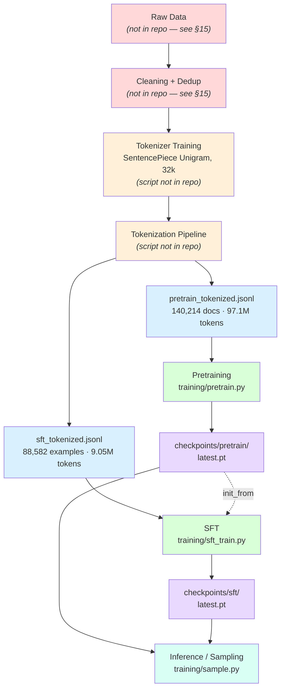
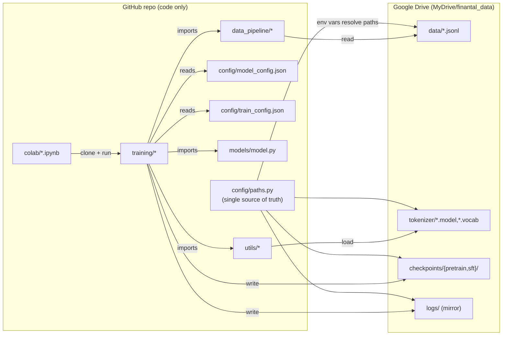
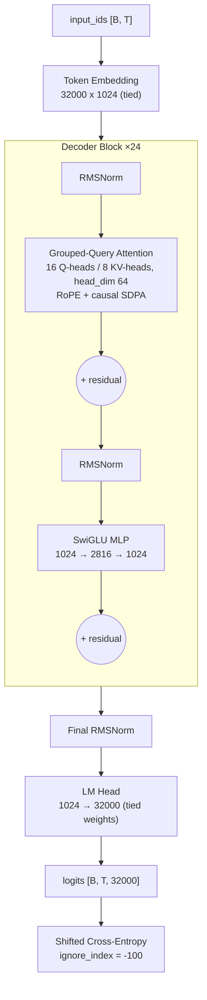
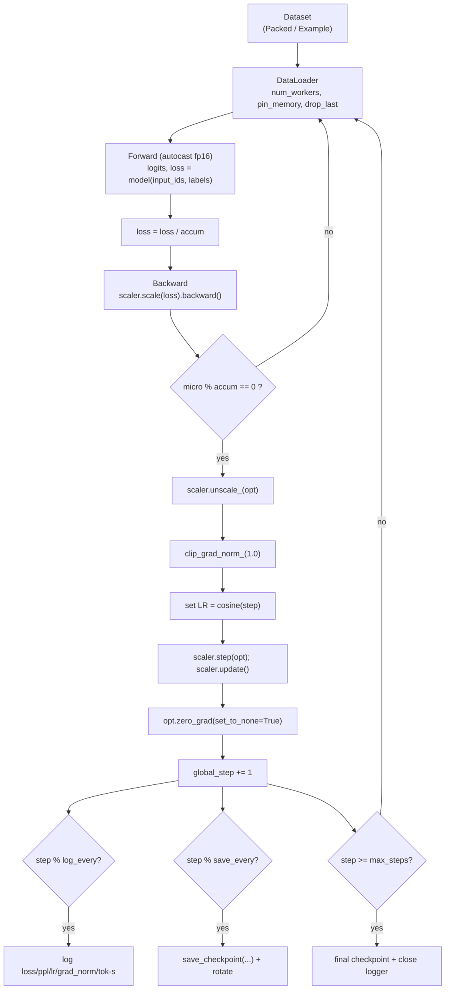
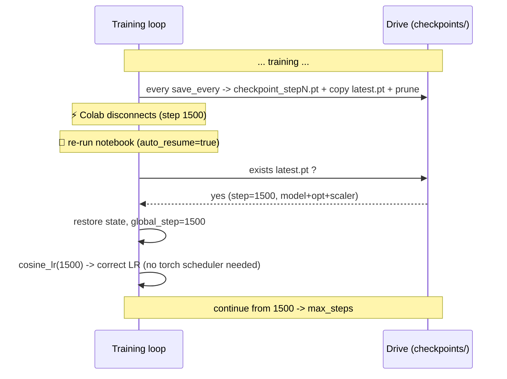
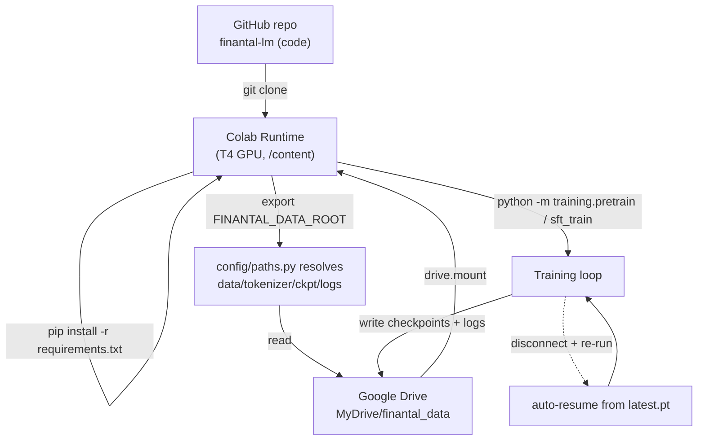
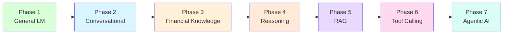

# Finantal-LM — Technical Reference & Architecture Audit

> **Status:** Living document · **Audit date:** 2026-06-21
> **Scope:** This document is produced by auditing the *current* codebase only. Every
> numeric value is **extracted from the actual files** (`config/`, `models/`, `training/`,
> `data_pipeline/`, and the tokenized data + tokenizer on Drive). Nothing is assumed.
> Where information is **not present in the repository**, it is flagged explicitly in
> [§15 Flagged Unknowns](#15-flagged-unknowns--undocumented-design-decisions).

### Changelog — 2026-06-21 (training-pipeline hardening)

These training-only improvements were applied **without changing the model architecture,
tokenizer, or data format**:

| Area | Change |
|---|---|
| **SFT prompt masking** | Loss is now computed **only on the assistant answer**. The collator rebuilds labels from `input_ids`, masking everything up to & including the `▁Assistant :` marker (`assistant_marker_ids = [11109, 32]`) with `-100`. Verified: marker present in 100% of sampled examples. On-disk data unchanged. |
| **Validation split** | Deterministic **95/5 train/val** for both pretrain (line-stride holdout in `PackedPretrainDataset`) and SFT (`train_val_split` Subset). Periodic **val loss + perplexity** via `common.evaluate`. |
| **Checkpointing** | Saves every **100 steps** as `step_<N>.pt` (+ always-updated `latest.pt`). Bundles model + optimizer + **scheduler** + scaler + step. `keep_last_n=5` (set `0` to keep all). |
| **Scheduler state** | Cosine schedule wrapped in `common.CosineScheduler` with `state_dict`/`load_state_dict`; LR remains a pure function of step → exact resume. |
| **Logging** | Every 10 steps: train loss, perplexity, LR, grad-norm, tok/s. Every 100 steps: val loss + perplexity. Mirrored to Drive. |

This **resolves §15 items #5 (prompt masking) and #7 (validation)**. The notes below
retain the original audit findings for historical context.

---

## Table of Contents
1. [Architecture Overview](#1-architecture-overview)
2. [Dataset Pipeline](#2-dataset-pipeline)
3. [Tokenizer](#3-tokenizer)
4. [Model Architecture](#4-model-architecture)
5. [Training Pipeline](#5-training-pipeline)
6. [Training Algorithms](#6-training-algorithms)
7. [Memory Optimizations](#7-memory-optimizations)
8. [Checkpoint System](#8-checkpoint-system)
9. [Google Colab Architecture](#9-google-colab-architecture)
10. [Current Model Specifications](#10-current-model-specifications)
11. [Current Training Strategy](#11-current-training-strategy)
12. [Roadmap](#12-roadmap)
13. [Project Tree](#13-project-tree)
14. [Reproducibility & Evidence](#14-reproducibility--evidence-how-each-number-was-obtained)
15. [Flagged Unknowns](#15-flagged-unknowns--undocumented-design-decisions)

---

## 1. Architecture Overview

Finantal-LM is a **decoder-only causal language model trained from scratch** in pure
PyTorch (no HuggingFace `Trainer`, no pretrained weights). The project is physically
split into **code (GitHub)** and **heavy assets (Google Drive)**, wired together by a
single path module (`config/paths.py`).

### 1.1 End-to-end flow



> 🔴 Red = **stages that exist conceptually but whose scripts/data are NOT in the repo**
> (raw data, cleaning, tokenizer-training, tokenization). The repo *starts* from
> already-tokenized JSONL. See [§15](#15-flagged-unknowns--undocumented-design-decisions).

### 1.2 Code ↔ asset relationships



| Layer | Modules | Responsibility |
|---|---|---|
| **Configuration** | `config/paths.py`, `config/model_config.json`, `config/train_config.json` | Central paths (env-driven), architecture hyper-params, training hyper-params |
| **Model** | `models/model.py` | From-scratch Llama-style decoder + loss + sampler |
| **Data** | `data_pipeline/dataset_loader.py`, `data_pipeline/collator.py` | Streaming/packed datasets, padding & label masking |
| **Training** | `training/pretrain.py`, `training/sft_train.py`, `training/common.py` | Loops, optimizer, schedule, AMP |
| **Utilities** | `utils/{logging,seed,checkpoint,tokenizer}.py` | Logging, reproducibility, checkpoint I/O, SentencePiece wrapper |
| **Runtime** | `colab/*.ipynb`, `scripts/*` | Colab bootstrap + CLI launchers |

---

## 2. Dataset Pipeline

### 2.1 What physically exists (measured)

| Split | File | Examples | Total tokens | Avg len | Min | Max | Has `labels` |
|---|---|---:|---:|---:|---:|---:|:--:|
| Pretrain | `data/pretrain_tokenized.jsonl` | **140,214** | **97,100,187** | 692.51 | 109 | 2048 | ✅ |
| SFT | `data/sft_tokenized.jsonl` | **88,582** | **9,050,243** | 102.17 | 20 | 2048 | ✅ |

*(Source: `data/dataset_stats.json`, regenerated via `scripts/build_dataset_stats.py`.)*

### 2.2 Language composition (measured, 4,000-line decoded sample per split)

| Split | Arabic letters | Latin letters | Arabic % | Latin % |
|---|---:|---:|---:|---:|
| Pretrain | 6,218,357 | 39,941 | **99.4%** | 0.6% |
| SFT | 901,148 | 80,190 | **91.8%** | 8.2% |

> **Finding:** the corpus is **overwhelmingly Arabic**. This is a measured property of
> the token streams (decoded with the project tokenizer), not an assumption. The exact
> ratio over the *full* corpus may differ slightly from this sample. The original raw
> sources and any language-balancing policy are **not documented in the repo** (§15).

### 2.3 JSONL format (extracted)

Both splits use the **same** schema — one JSON object per line:

```json
{"input_ids": [3435, 10391, ...], "labels": [3435, 10391, ...]}
```

- `input_ids` — list of integer token IDs (already tokenized; the repo never re-tokenizes raw text for training).
- `labels` — **identical to `input_ids`** in every sampled line of *both* splits.

> **Important consequence:** because `labels == input_ids` and the SFT collator honours
> the provided labels (`mask_prompt=false`), **SFT currently computes loss over the entire
> sequence (prompt + response), with no prompt masking.** This is a real, current behaviour
> worth a conscious decision later (see §11 and §15).

### 2.4 Pretraining vs SFT data — the difference

| Aspect | Pretraining | SFT |
|---|---|---|
| Purpose | Learn general language modelling | Learn instruction/response formatting |
| Unit per line | A document (avg ~693 tokens) | An instruction example (avg ~102 tokens) |
| Loss target | Next-token over packed stream | Next-token over the example |
| Packing | **Yes** — concatenated into 1024-token blocks | **No** — one example per batch row, padded |
| Prompt masking | N/A | **Not applied** (labels == input_ids) |
| Loader | `PackedPretrainDataset` (IterableDataset, streamed) | `JsonlExampleDataset` (map-style, offset-indexed) |

### 2.5 Data pipeline diagram (as implemented in code)

```mermaid
flowchart TD
    subgraph PRE["Pretraining path"]
        P1["pretrain_tokenized.jsonl"] --> P2["PackedPretrainDataset<br/>stream + shard by worker"]
        P2 --> P3["concat docs + EOS(3)<br/>chop into 1024-token blocks"]
        P3 --> P4["PackedCollator<br/>stack -> [B,1024]"]
        P4 --> P5["model(input_ids, labels)"]
    end
    subgraph SFTP["SFT path"]
        S1["sft_tokenized.jsonl"] --> S2["build_offset_index<br/>(.offsets.npy cache)"]
        S2 --> S3["JsonlExampleDataset<br/>seek line -> {input_ids,labels}"]
        S3 --> S4["CausalLMCollator<br/>right-pad, pad-labels=-100"]
        S4 --> S5["mask pad positions -> -100"]
        S5 --> S6["model(input_ids, labels)"]
    end
```



> **Cleaning / dedup / tokenization scripts are not in the repo** — the data arrives
> pre-tokenized. See §15. `data_pipeline/` only *consumes* tokenized JSONL.

---

## 3. Tokenizer

### 3.1 Facts extracted

| Property | Value | Evidence |
|---|---|---|
| Library | **SentencePiece** (`sentencepiece==0.2.1` available locally) | `utils/tokenizer.py`, runtime load |
| Algorithm | **Unigram** | `.vocab` stores a **log-probability per piece** (e.g. `-3.47111`); BPE vocabs have no per-piece scores. Special tokens (ids 0–3) have score `0`. |
| Vocabulary size | **32,000** | `sp.get_piece_size()` and `model_config.vocab_size` |
| Output files | `finantal_tokenizer.model`, `finantal_tokenizer.vocab` | `tokenizer/` on Drive |
| Subword marker | `▁` (U+2581) for word-start | observed in `.vocab` |

### 3.2 Special tokens (extracted)

| Token | ID | Role in code |
|---|---:|---|
| `<pad>` | 0 | `pad_token_id` — padding; masked to `-100` in labels |
| `<unk>` | 1 | `unk_token_id` — unknown |
| `<s>`  | 2 | `bos_token_id` — beginning-of-sequence (added by `SPTokenizer.encode(add_bos=True)` at inference) |
| `</s>` | 3 | `eos_token_id` — end-of-sequence; **used as the document separator** when packing pretraining blocks |

### 3.3 Why Unigram (general rationale)

> ⚠️ The repo does **not record** the rationale (§15). The following is the standard
> justification for the algorithm the artifacts reveal:

- **Better for morphologically rich languages (Arabic):** Unigram chooses a probabilistically optimal segmentation rather than greedy merges, which tends to handle Arabic prefixes/suffixes and clitics more cleanly than BPE.
- **Probabilistic vocabulary:** each piece carries a log-prob, enabling subword regularization (sampling alternative segmentations) during tokenizer training.
- **Single-pass decoding:** detokenization is unambiguous via the `▁` marker.

### 3.4 Training method

> ⚠️ **The tokenizer-training script and its hyper-parameters are NOT in the repo.**
> Only the trained `.model`/`.vocab` are present. We can confirm *what was produced*
> (Unigram, 32k vocab, `<pad>/<unk>/<s>/</s>` at 0–3) but **not** the training corpus,
> `character_coverage`, or `input_sentence_size`. See §15.

---

## 4. Model Architecture

### 4.1 Type

A **GPT-style, decoder-only, causal Transformer** in the **Llama family** (pre-norm
RMSNorm + RoPE + Grouped-Query Attention + SwiGLU + weight tying). Defined entirely in
[`models/model.py`](../models/model.py) — `class FinantalForCausalLM`.

### 4.2 Extracted hyper-parameters (`config/model_config.json`)

| Field | Value |
|---|---:|
| `num_hidden_layers` | **24** |
| `hidden_size` | **1024** |
| `intermediate_size` (MLP) | **2816** |
| `num_attention_heads` | **16** |
| `num_key_value_heads` | **8** (GQA, n_rep = 2) |
| `head_dim` | **64** |
| `max_position_embeddings` (context) | **1024** |
| `vocab_size` | **32,000** |
| `rope_theta` | 10,000.0 |
| `rms_norm_eps` | 1e-5 |
| `attention_dropout` / `residual_dropout` | 0.0 / 0.0 |
| `initializer_range` | 0.02 |
| `tie_word_embeddings` | **true** |
| `use_gradient_checkpointing` | **true** |

### 4.3 Component-by-component (from code)

| Component | Implementation detail (in `models/model.py`) |
|---|---|
| **Embedding** | `nn.Embedding(32000, 1024, padding_idx=0)`; row 0 zeroed at init |
| **RMSNorm** | Pre-norm; computed in fp32 then cast back; learnable scale; `eps=1e-5` |
| **RoPE** | Rotary embeddings on Q,K; `cos/sin` cached per (seq_len, device, dtype); `theta=10000` |
| **Attention (GQA)** | `q_proj→16×64`, `k_proj/v_proj→8×64`, KV repeated ×2; `F.scaled_dot_product_attention(is_causal=True)`; no bias |
| **Causal masking** | Implicit via `is_causal=True` (no `[T,T]` mask materialized) |
| **MLP (SwiGLU)** | `down( SiLU(gate(x)) * up(x) )`; `gate/up: 1024→2816`, `down: 2816→1024`; no bias |
| **Residuals** | `x = x + attn(norm(x))`; `x = x + mlp(norm(x))` (two RMSNorms per block) |
| **Final norm** | RMSNorm before LM head |
| **LM head** | `nn.Linear(1024, 32000, bias=False)`, **weight-tied** to the embedding |
| **Init** | Normal(0, 0.02); residual projections (`o_proj`, `down_proj`) scaled by `1/√(2·L)` |
| **Loss** | Cross-entropy with internal shift (predict token i+1), `ignore_index=-100`, logits upcast to fp32 |

### 4.4 Architecture diagram



### 4.5 Parameter count (computed exactly from config)

| Group | Parameters |
|---|---:|
| Token embedding (tied → counted once) | 32,768,000 |
| Per decoder block | 11,798,528 |
| × 24 blocks | 283,164,672 |
| Final RMSNorm | 1,024 |
| LM head | 0 (tied) |
| **Total** | **315,933,696 ≈ 316M** |
| **Non-embedding** | **283,165,696 ≈ 283M** |

> Weight tying saves a separate 32.77M-param output matrix (~131 MB in fp32).

---

## 5. Training Pipeline

Both `pretrain.py` and `sft_train.py` share the same hand-written loop shape
(`training/common.py` provides optimizer/schedule/AMP helpers).



### Step-by-step (exact order in code)

1. **Dataset** → packed blocks (pretrain) or padded examples (SFT).
2. **DataLoader** → batches of `micro_batch_size`.
3. **Forward** under `torch.autocast` (fp16) → `(logits, loss)`; loss divided by `accum`.
4. **Backward** → `scaler.scale(loss).backward()` (gradient accumulation across `accum` micro-steps).
5. On the accumulation boundary: **unscale → clip(1.0) → set cosine LR → optimizer step → update scaler → zero grads → `global_step += 1`**.
6. **Logging** every `log_every` optimizer steps; **checkpoint** every `save_every`; stop at `max_steps`.

---

## 6. Training Algorithms

All values below are extracted from `config/train_config.json` and `training/common.py`.

| Technique | Pretrain | SFT | Where | Why |
|---|---|---|---|---|
| **Optimizer** | AdamW (`fused` if CUDA; else 8-bit if enabled) | same | `common.build_optimizer` | Standard, stable for LM; fused for speed |
| **Decay groups** | weight decay on ≥2D params only | same | `build_optimizer` | Don't decay norms/biases |
| **LR scheduler** | cosine + linear warmup → `min_lr` | same | `common.cosine_lr` | Smooth decay; standard for LM pretraining |
| **Base LR** | **3e-4** | **2e-5** | config | High for pretrain, low for fine-tune |
| **Min LR** | 3e-5 | 2e-6 | config | Floor of cosine |
| **Warmup** | **400 steps** | **3% of max_steps** (`warmup_ratio`) | config | Avoid early instability |
| **Weight decay** | **0.1** | **0.0** | config | Regularize pretrain; none for short SFT |
| **β1, β2** | 0.9, 0.95 | 0.9, 0.95 | config | LM-typical betas |
| **eps** | 1e-8 | 1e-8 | config | Numerical stability |
| **Grad clip** | **1.0** (global L2 norm) | 1.0 | loop | Prevent exploding grads |
| **Grad accumulation** | **16** | **8** | config | Large effective batch on small VRAM |
| **Micro batch size** | **8** | **4** | config | Fits T4 memory |
| **Mixed precision** | **fp16** + GradScaler | fp16 | `common.resolve_amp` | 2× throughput, ½ activation memory |
| **bf16/auto** | supported; falls back to fp16 if GPU lacks bf16 | same | `resolve_amp` | T4 has no bf16 → uses fp16 |
| **Grad checkpointing** | **on** (`model_config`) | on | `model.py` | Trade compute for memory |
| **8-bit optimizer** | off (toggle) | off (toggle) | `build_optimizer` | Optional, for ≥1B models |

### Batch-size arithmetic (computed)

| Quantity | Pretrain | SFT |
|---|---:|---:|
| Micro batch (sequences) | 8 | 4 |
| Grad accumulation | 16 | 8 |
| **Effective batch (sequences)** | **128** | **32** |
| Sequence length | 1024 | ≤1024 (padded) |
| **Tokens / optimizer step** | **131,072** | ≤ 32,768 |
| Steps for one pass over corpus | ~741 | ~2,768 / epoch |
| Configured horizon | `max_steps = 8000` (~10.8 passes) | `num_epochs = 3` (~8,305 steps) |

---

## 7. Memory Optimizations

| Technique | Status in repo | Mechanism | Approx. saving |
|---|---|---|---|
| **Efficient attention (SDPA)** | ✅ `F.scaled_dot_product_attention(is_causal=True)` | Avoids materializing the `[T,T]` score matrix; dispatches to fused/mem-efficient kernels | Attention memory ~O(T) instead of O(T²) |
| **Gradient checkpointing** | ✅ on, per-layer, `use_reentrant=False` | Recomputes block activations in backward instead of storing them | Activation memory ↓ roughly √-scaling with depth (large; enables bigger batch/model) |
| **AMP / fp16** | ✅ `autocast` + `GradScaler` | Half-precision activations & matmuls | Activation/compute memory ↓ ~50% |
| **8-bit optimizer** | ⚙️ optional (`use_8bit_optimizer`, default off) | `bitsandbytes.AdamW8bit` quantizes optimizer state | Optimizer state ↓ ~75% (Adam: 8→2 bytes/param) |
| **Weight tying** | ✅ `tie_word_embeddings=true` | Embedding == LM-head weights | ↓ 32.77M params (~131 MB fp32) |

> ⚠️ **FlashAttention nuance (must flag):** the code uses **PyTorch SDPA**, not the
> external `flash-attn` package. On a **T4 (sm_75)** FlashAttention-2 is **not supported**,
> so SDPA falls back to the **memory-efficient** or **math** kernel. The O(T²)-memory
> avoidance still applies, but the *FlashAttention-2 speed kernel* specifically is not
> active on T4. It would activate on Ampere+ (A100/L4/etc.).

---

## 8. Checkpoint System

Implemented in [`utils/checkpoint.py`](../utils/checkpoint.py).

### 8.1 What a checkpoint contains (extracted)

| Key | Saved? | Notes |
|---|:--:|---|
| `step` | ✅ | global optimizer step (drives resume + LR schedule) |
| `model` | ✅ | `state_dict` (unwrapped from compile/DataParallel) |
| `optimizer` | ✅ | full AdamW state |
| `scaler` | ✅ | `GradScaler` state (fp16) |
| `scheduler` | ⚠️ **None** | **No torch LR-scheduler object exists.** LR is a pure function of `step` (`common.cosine_lr`), so restoring `step` fully restores the schedule. The key is present but null. |
| `model_config` | ✅ | architecture dict (lets `sample.py` rebuild the model) |

### 8.2 Storage & rotation

- **Location:** `CHECKPOINT_DIR/{pretrain,sft}/` → on **Google Drive** (`config/paths.py`).
- **Files:** `checkpoint_step<N>.pt` (atomic write via `.tmp` + `os.replace`).
- **`latest.pt`:** a **copy** (not symlink — Colab/Windows-safe) of the newest checkpoint.
- **Rotation:** `keep_last_n = 3` — older step files are pruned; `latest.pt` always kept.

### 8.3 Resume behaviour (extracted)

- **Auto-resume** (`auto_resume=true`, default): if `<output_dir>/latest.pt` exists, training restores **model + optimizer + scaler + step** and continues.
- **Explicit:** `--override resume_from=/path/checkpoint_stepN.pt` takes priority.
- **SFT init:** if not resuming, SFT loads **weights only** from `init_from` (default `checkpoints/pretrain/latest.pt`) with a **fresh** optimizer.



---

## 9. Google Colab Architecture



| Component | Holds | Lifetime | Notes |
|---|---|---|---|
| **GitHub repo** | code only | permanent | `.gitignore` blocks all data/weights |
| **Google Drive** | data, tokenizer, checkpoints, log mirror | permanent | survives disconnects |
| **Colab Runtime** | cloned repo + GPU + Python env | ephemeral (resets on disconnect) | nothing important persists here |

**Bootstrap order** (`colab/setup_colab.ipynb`): check GPU → mount Drive → clone repo →
`pip install` → set `FINANTAL_DATA_ROOT` → `verify_assets()`. The two run notebooks repeat
this then launch training, plot loss, and run a generation sanity check.

---

## 10. Current Model Specifications

> Extracted from `config/model_config.json` + `config/train_config.json` (pretrain section). **No assumptions.**

| Specification | Value |
|---|---|
| Model type | Decoder-only causal Transformer (Llama-style) |
| Layers | 24 |
| Hidden size | 1024 |
| Intermediate size | 2816 |
| Attention heads | 16 |
| KV heads | 8 (GQA) |
| Head dim | 64 |
| Context length | 1024 |
| Vocabulary size | 32,000 |
| Activation | SwiGLU (SiLU gate) |
| Attention type | Grouped-Query Attention, causal, via SDPA |
| Positional embedding | RoPE (θ = 10,000) |
| Normalization | RMSNorm (pre-norm, eps 1e-5) |
| Weight tying | Yes (embedding ↔ LM head) |
| Optimizer | AdamW (β = 0.9/0.95, eps 1e-8) |
| Scheduler | Cosine + linear warmup |
| Learning rate (pretrain / SFT) | 3e-4 / 2e-5 |
| Min LR (pretrain / SFT) | 3e-5 / 2e-6 |
| Weight decay (pretrain / SFT) | 0.1 / 0.0 |
| Grad clip | 1.0 |
| Precision | fp16 (AMP + GradScaler) |
| Micro batch (pretrain / SFT) | 8 / 4 |
| Grad accumulation (pretrain / SFT) | 16 / 8 |
| Effective batch (pretrain / SFT) | 128 / 32 sequences |
| **Parameters** | **≈ 315.9M total (283.2M non-embedding)** |

---

## 11. Current Training Strategy

### 11.1 Stage 1 — Pretraining (`training/pretrain.py`)

- **Data:** `pretrain_tokenized.jsonl` (140,214 docs, 97.1M tokens, ~99% Arabic).
- **Objective:** next-token prediction over **packed** 1024-token blocks (documents concatenated, separated by `</s>`=3, chopped to uniform blocks → zero padding waste).
- **Horizon:** `max_steps=8000` ≈ 10.8 passes over the corpus at 131,072 tokens/step.
- **What the model learns:** Arabic morphology, syntax, general world/text patterns, and the statistical structure of the corpus — a **general Arabic language model** foundation.

### 11.2 Stage 2 — SFT (`training/sft_train.py`)

- **Init:** weights loaded from `checkpoints/pretrain/latest.pt` (fresh optimizer).
- **Data:** `sft_tokenized.jsonl` (88,582 examples, avg 102 tokens). Examples appear to encode an instruction→response structure (role-marker tokens visible in the IDs).
- **Objective:** next-token prediction over each example; LR lowered to 2e-5, weight decay 0, 3 epochs.
- **What the model learns:** to follow the instruction/response **format** and produce task-style completions.

> ⚠️ **Current SFT caveat (measured):** `labels == input_ids` and `mask_prompt=false`, so
> **loss is taken on the whole sequence including the prompt.** The model is therefore also
> trained to generate the prompt text, not only the response. The role/prompt-response
> **chat template is not defined in code** (§15). If response-only supervision is desired,
> this is the first thing to change — *no model/training-logic change was made in this audit.*

---

## 12. Roadmap

> A staged plan. Each phase lists its goal and the **data it requires** (which mostly does
> not yet exist in the repo). This is a proposal for the team, not implemented code.



| Phase | Goal | Data required | Status |
|---|---|---|---|
| **1 — General LM** | Fluent Arabic next-token model | Large clean Arabic corpus (have: 97.1M tokens) | **In progress** (pretrain pipeline exists) |
| **2 — Conversational** | Follow instructions / multi-turn chat | Instruction + multi-turn dialogue data, **with a defined chat template + prompt masking** | Partially started (SFT exists; template/masking missing) |
| **3 — Financial Knowledge** | Domain expertise (the "Finantal" purpose) | Curated financial corpora (filings, definitions, Q&A) for continued pretraining + domain SFT | Not started |
| **4 — Reasoning** | Multi-step / chain-of-thought answers | CoT / reasoning-trace datasets; possibly preference data (DPO/RLHF) | Not started |
| **5 — RAG** | Ground answers in retrieved documents | Retrieval corpus + embeddings index; RAG-style training/eval pairs | Not started (no retrieval code in repo) |
| **6 — Tool Calling** | Emit structured tool/function calls | Tool-call traces (function schemas + invocations) | Not started (would need special tokens/format) |
| **7 — Agentic AI** | Plan + act over multiple steps/tools | Agent trajectories (observation→thought→action loops) | Not started |

**Cross-cutting prerequisites** the roadmap will need (currently absent — §15):
a validation/eval split + eval loop, a documented chat template, prompt-masking for SFT,
and likely a larger context window (currently 1024) for RAG/agentic phases.

---

## 13. Project Tree

```
finantal-lm/                         # GitHub repo — CODE ONLY (no data/weights)
├── config/
│   ├── __init__.py
│   ├── paths.py                     # ⭐ single source of truth for all paths (env-driven)
│   ├── model_config.json            # architecture hyper-params (24L/1024/16h/8kv/32k…)
│   └── train_config.json            # pretrain + sft hyper-params (null paths → use paths.py)
├── models/
│   ├── __init__.py
│   └── model.py                     # FinantalForCausalLM: RMSNorm+RoPE+GQA+SwiGLU, loss, generate()
├── data_pipeline/
│   ├── __init__.py
│   ├── dataset_loader.py            # PackedPretrainDataset (stream), JsonlExampleDataset (offset index), stats
│   └── collator.py                  # CausalLMCollator (pad + label=-100), PackedCollator, IGNORE_INDEX
├── training/
│   ├── __init__.py
│   ├── common.py                    # build_optimizer, cosine_lr, set_lr, resolve_amp, param counter
│   ├── pretrain.py                  # ⭐ pretraining loop (entry: python -m training.pretrain)
│   ├── sft_train.py                 # ⭐ SFT loop (entry: python -m training.sft_train)
│   └── sample.py                    # generation sanity check (python -m training.sample)
├── utils/
│   ├── __init__.py
│   ├── logging.py                   # TrainLogger: console + JSONL metrics, local + Drive mirror
│   ├── seed.py                      # set_seed, seed_worker (reproducibility)
│   ├── checkpoint.py                # save/load/rotate, latest.pt, weights-only init
│   └── tokenizer.py                 # SPTokenizer wrapper (SentencePiece)
├── scripts/
│   ├── build_dataset_stats.py       # regenerate dataset_stats.json (stdlib only)
│   ├── build_notebooks.py           # regenerate the 3 colab notebooks
│   ├── run_pretrain.sh              # shell launcher
│   └── run_sft.sh                   # shell launcher
├── colab/
│   ├── setup_colab.ipynb            # one-time bootstrap (mount/clone/install/verify)
│   ├── run_pretrain_colab.ipynb     # end-to-end pretraining notebook
│   └── run_sft_colab.ipynb          # end-to-end SFT notebook
├── docs/
│   └── TECHNICAL_DOCUMENTATION.md   # ← this document
├── requirements.txt
├── README.md
└── .gitignore                       # blocks *.jsonl, *.model, *.vocab, *.pt, checkpoints/, data/, logs/

MyDrive/finantal_data/               # Google Drive — DATA + WEIGHTS (never in Git)
├── data/
│   ├── pretrain_tokenized.jsonl     # 140,214 docs · 97.1M tokens
│   ├── sft_tokenized.jsonl          # 88,582 examples · 9.05M tokens
│   └── dataset_stats.json           # measured statistics
├── tokenizer/
│   ├── finantal_tokenizer.model     # SentencePiece Unigram, 32k
│   └── finantal_tokenizer.vocab
├── checkpoints/
│   ├── pretrain/                    # checkpoint_step*.pt + latest.pt
│   └── sft/
└── logs/                            # mirrored metrics (pretrain_metrics.jsonl, sft_metrics.jsonl)
```

---

## 14. Reproducibility & Evidence (how each number was obtained)

| Claim | How verified |
|---|---|
| 315.9M params | Computed from `model_config.json` using the exact layer formula matching `models/model.py` |
| Unigram tokenizer | `.vocab` contains per-piece log-probabilities (Unigram signature); specials at 0–3 score 0 |
| 32,000 vocab | `sp.get_piece_size()` and config |
| 140,214 / 88,582 examples; 97.1M / 9.05M tokens | `scripts/build_dataset_stats.py` full streaming scan → `dataset_stats.json` |
| 99.4% / 91.8% Arabic | Decoded 4,000-line samples with the project tokenizer; counted Arabic vs Latin Unicode letters |
| `labels == input_ids` (both splits) | Direct inspection of first lines + 5,000-line scan |
| Effective batch 128 / 32 | `micro_batch_size × gradient_accumulation_steps` from `train_config.json` |
| Checkpoint contents | Read `utils/checkpoint.py` (`save_checkpoint` payload dict) |

---

## 15. Flagged Unknowns & Undocumented Design Decisions

> Per the audit requirement: nothing below is assumed-filled. These are genuinely
> **absent from the repository** and should be documented or added by the team.

1. **Raw data sources** — only *tokenized* JSONL exists. The original corpora, licensing, and provenance are unknown.
2. **Cleaning & deduplication method** — no cleaning/dedup scripts in the repo. Unknown whether dedup, quality filtering, or PII removal was applied.
3. **Tokenizer-training script & hyper-parameters** — only `.model`/`.vocab` are present. `character_coverage`, training corpus, and `input_sentence_size` are unknown. Unigram + 32k are confirmed *from the artifacts*, but the **rationale** for choosing Unigram is not recorded.
4. **Tokenization pipeline** — the script that turned raw text into `*_tokenized.jsonl` is not in the repo (no BOS/EOS-insertion policy, truncation policy, or doc-boundary policy is documented; note pretrain max length is 2048 in data but training uses 1024 blocks).
5. **SFT chat template & prompt masking** — `labels == input_ids`, `mask_prompt=false` ⇒ full-sequence loss. The role/prompt-response template (the meaning of the leading marker tokens) is **not defined in code**. Response-only supervision is **not** currently happening.
6. **`final_pretrain_dataset.jsonl` / `final_sft_dataset.jsonl`** — referenced in the original project plan but **do not exist** on disk.
7. **Validation / evaluation** — there is **no eval split and no eval loop**; perplexity is logged on *training* batches only. No held-out metric exists.
8. **Arabic/English target ratio** — measured ~99%/~92% Arabic, but no documented *policy* on language balance.
9. **FlashAttention-2 on T4** — code uses PyTorch SDPA; FA-2 kernel is unavailable on T4 (sm_75), so the speed benefit is not realized on the default Colab GPU (memory benefit still applies).
10. **Intended final model size** — config defaults to ~316M; `model_config.json` documents 1B/3B presets but the **target production size is not decided** in the repo.

---

*End of document. This audit modified no source files; it only reads the project and records findings.*
